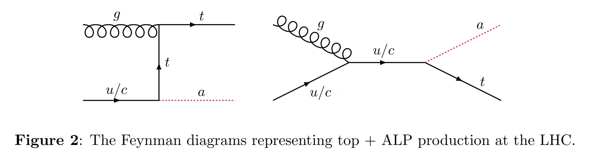
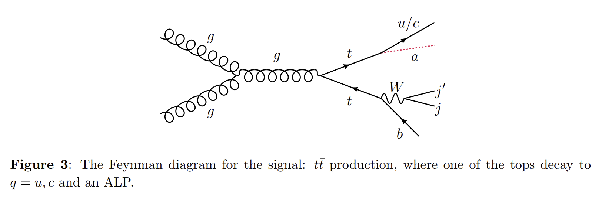

- collected from [CalRatio-top tasks / plan](https://docs.google.com/document/d/1IzgNQl4b_5GOsa0NB9NVhChjP4yNDJwKi0Vq3Rzrol0/edit?tab=t.0#heading=h.yayif0vidfnc)
# single top + DV
- [charming ALP](https://arxiv.org/pdf/2202.09371) (ax): 
	1. $pp \to t + ax$ , not generated.
	2. $pp \to t \bar{t}, \  t \to u/c + ax$

# ttbar + DV
